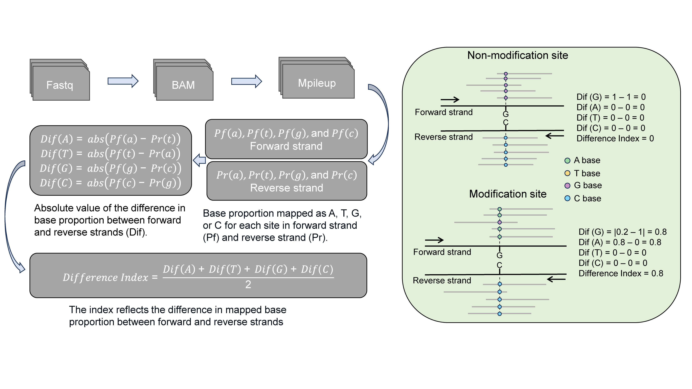
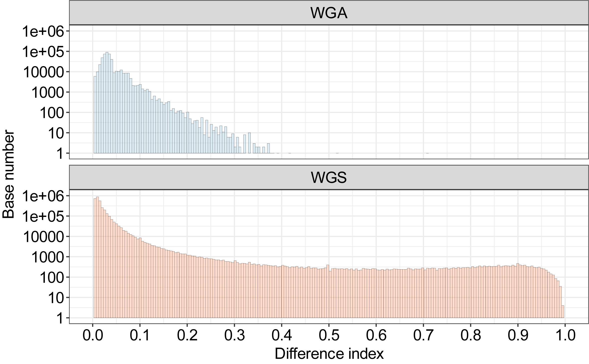
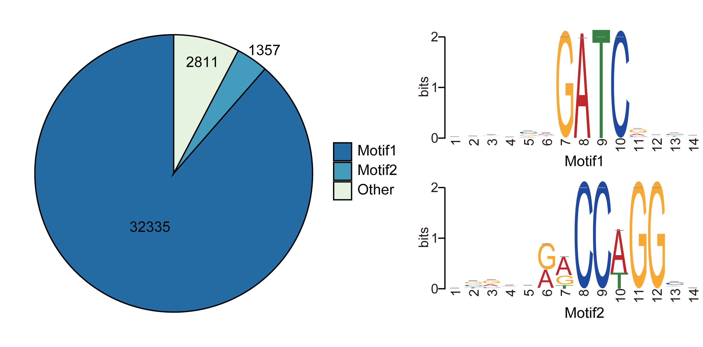
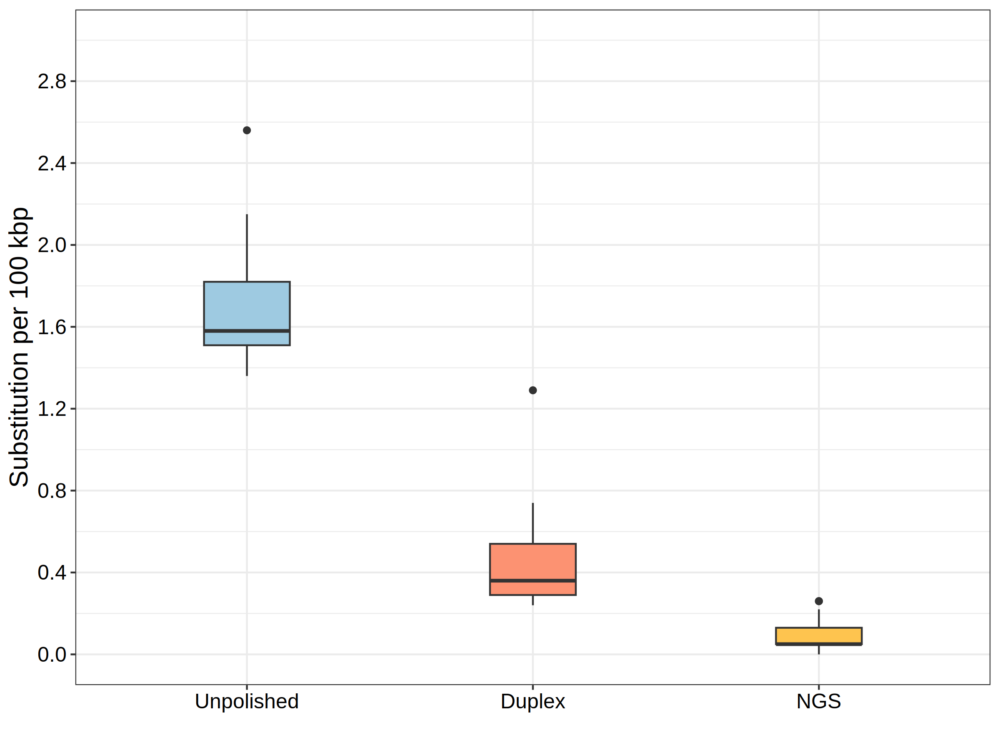

# Hammerhead


<a href="https://pypi.python.org/pypi/Hammerhead-View" rel="pypi"> </a>
[](https://www.gnu.org/licenses/old-licenses/gpl-2.0.en.html)

This project is designed to find potential modification sites.


## Workflow



The Hammerhead was developed specifically to identify potential modification sites using Nanopore R10.4.1 simplex reads. It leverages the strand-specific error pattern observed in these reads to detect modifications.


The pipeline utilizes a self-defined metric called the difference index to quantify the discrepancy in observed accuracy between the forward and reverse strands at individual sites. This difference index serves as a measure of the potential modification probability. A higher value of the difference index indicates a higher likelihood of modification at the corresponding site.


## Installation

To use this tool, you'll need to install additional tools or packages for read processing, including samtools and minimap2. The following command can help you install dependencies.

```shell
# test verison for dependences
# minimap2	2.17
# samtools	1.17
# bedtools	2.30.0

conda install -c bioconda -c conda-forge minimap2 samtools bedtools -y
conda install -c bioconda -c conda-forge minimap2==2.17 samtools==1.17 bedtools==2.30.0 -y
```

To install this tool, please use the following command.
```shell
pip install Hammerhead-View
```


## Quick usage

`Hammerhead` can be run in two different strategies to detect methylation:

This first strategy is to select the sites with a difference index over the cutoff, the default is 0.35.

```shell
hammerhead --ref genome.fa --read input.fastq --cpu 4
```

The second strategy is to select the top N sites, based on the difference index sorted from the largest to the smallest, the default number is 2000.

```shell
hammerhead --ref genome.fa --read input.fastq --cpu 4 --method top
```


## Tool showcase

To show the potential of Hammerhead to identify the modifications in the bacterium. Here, two datasets from  *E. coli* were used to call methylation including whole-genome sequencing (WGS) and whole-genome amplification (WGA) R10.4.1 simplex reads. The *dam* and *dcm* genes were found in the genome of the used *E. coli* strain. These two genes are associated with the G6mATC and C5mCWGG methylation.



The distribution of difference index for sites in *E. coli* genompe. The WGA reads were used as a negative control due to the lack of inherent methylation information. Based on the background noise of WGA reads, the sites with a difference index over 0.35 were regarded as potential modification sites.



The motif of C<u>C</u>WGG and G<u>A</u>TC was enriched using the sequences near these potential modification sites (-10 bp to +10 bp). 

**Note:** Two datasets are available at the [here](https://figshare.com/articles/dataset/_i_E_coli_i_datasets/24298663). Both datasets were basecalled using the modification aware model, which is available in the directory of `modification_aware_basecalling_model`.


To demonstrate the effectiveness of the polishing strategy based on the Hammerhead  in correcting substitution error types (`G2A` and `C2T`) caused by DNA modifications in assemblies, we present the substitution rates of 15 assemblies. These assemblies were generated using 40-， 50-, and 60-fold random subsampling *Acinetobacter pittii* R10.4.1 reads. We compared the results obtained from different polishing approaches with the reference chromosome.

- No polishing
- Polishing potential modification sites with approximate 10-fold duplex reads
- Polishing total assemblies with 50-fold next-generation sequencing (NGS) reads




# Documentation

For more details about the usage of Hammerhead and results profiling, please refer to the documentation.

**All rights reserved.**


